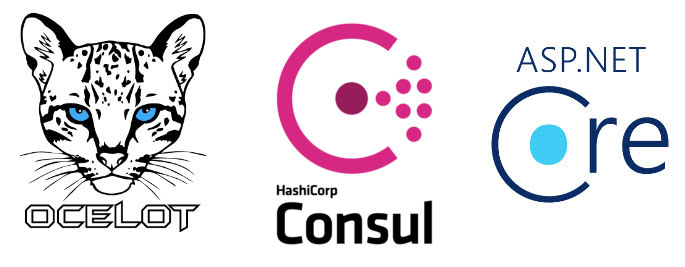
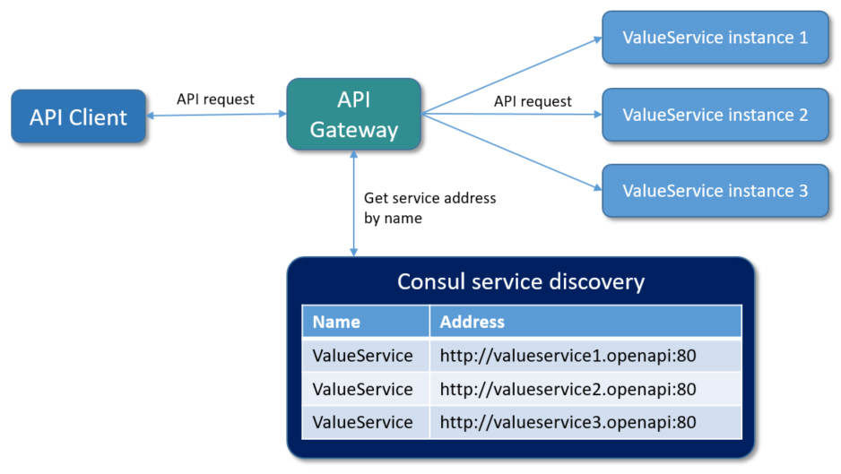
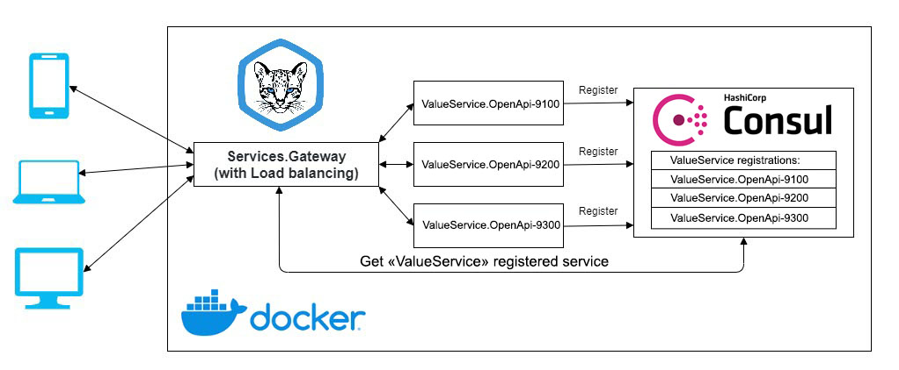
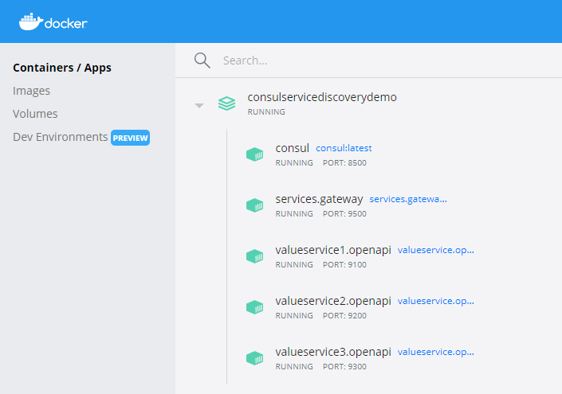
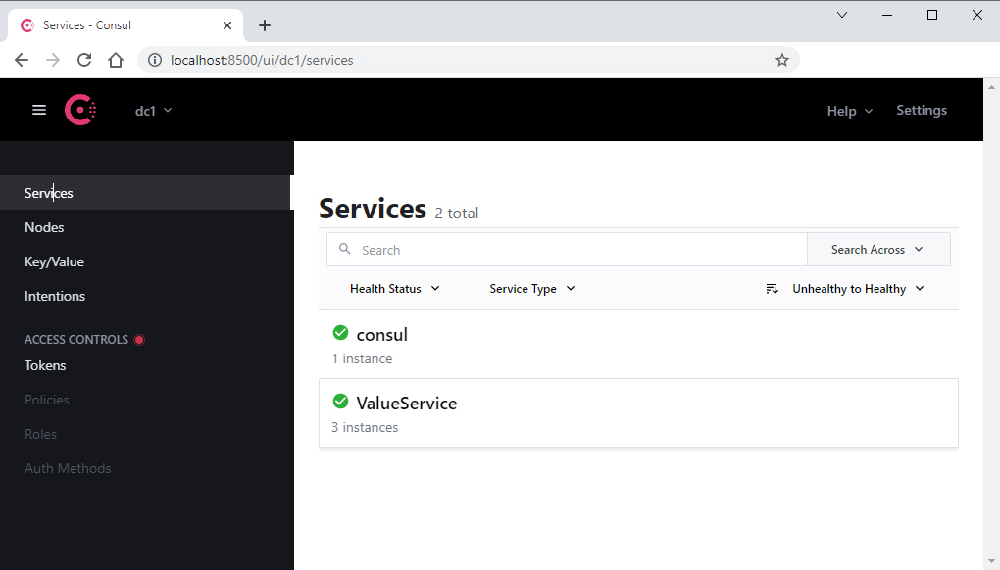
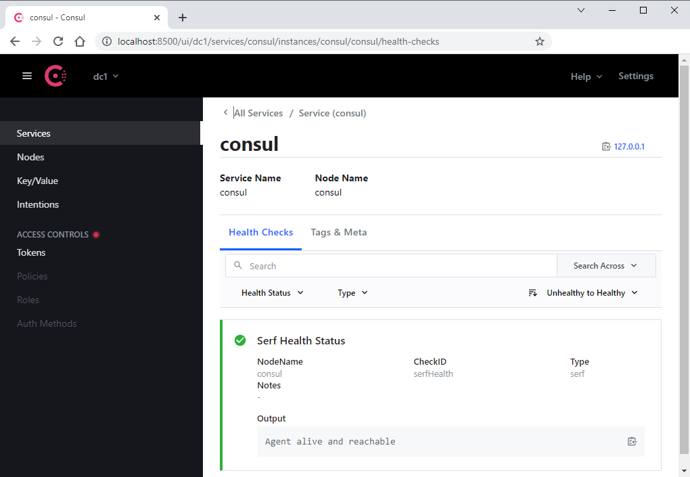
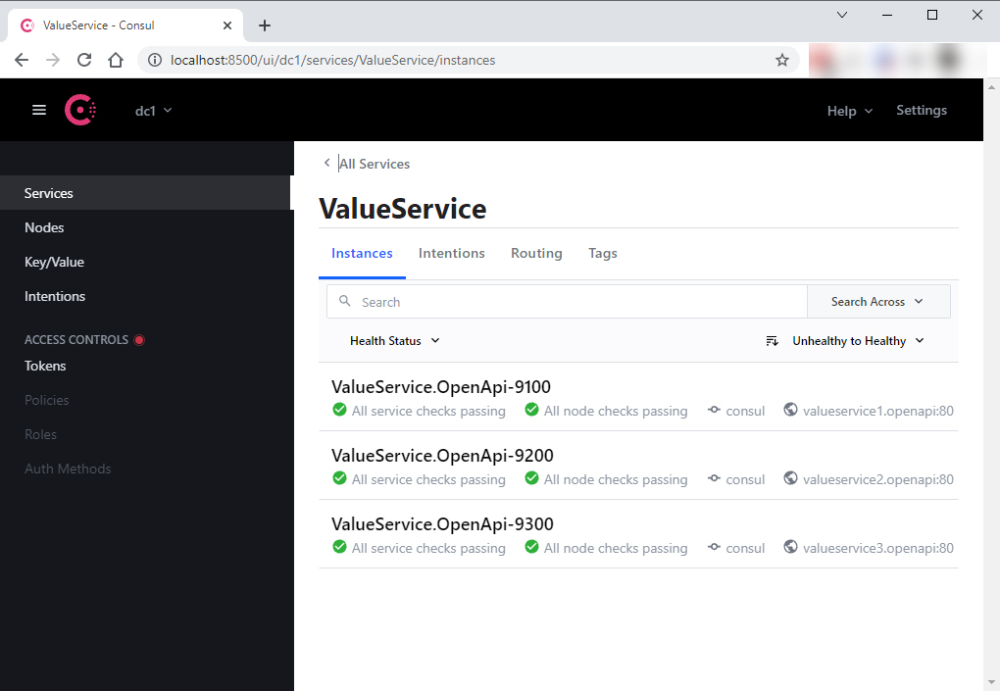
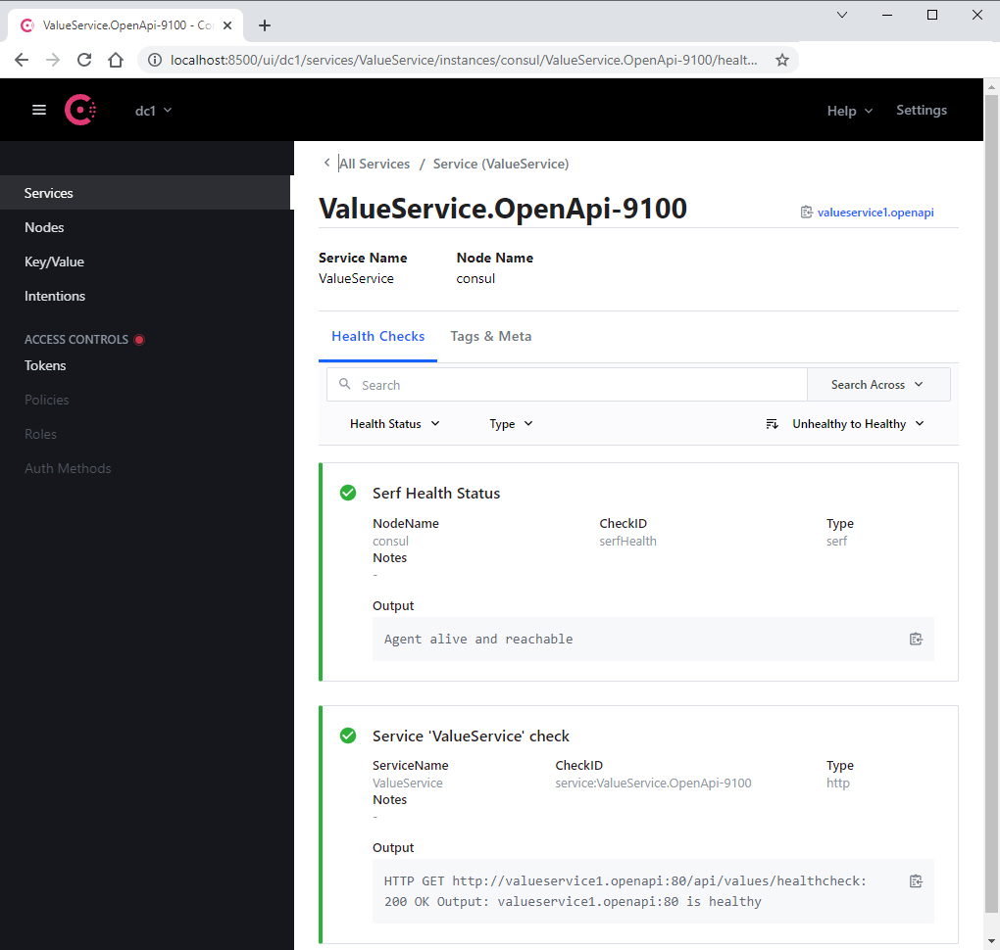
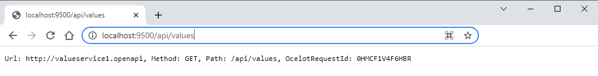
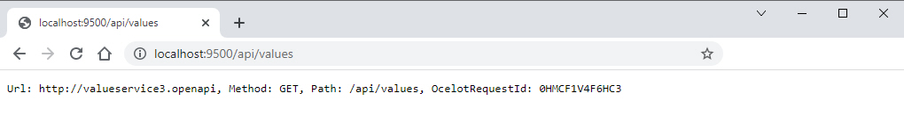

# Building API Gateway with load balancer and service discovery
When designing solutions based on the micro service architecture, we often encounter the requirement for quick and easy management of the entire system, the highest possible automation, without the necessary adjustment of individual components.

This is a real challenge and that’s why I decided to prepare a tutorial that demonstrates how to establish a micro service architecture in the simplest possible way, which can be quickly and very easily scaled and adapted to client requirements.

I did not want to interfere with the code and settings of individual services, but to control the system only with orchestrating containers in Docker.

The result is a simple micro service architecture that can be easily scaled with just a few changes in container settings, everything else is provided by Ocelot as gateway/load balancer and Consul as service discovery agent.

Such an architecture allows us redeployment of a single service without coordinating the deployment within other services. Redeployed service is automatically registered at service discovery and imediatelly available through gateway. You can imagine how big a boost this is for every development team!

Sure, using a single gateway service becomes a single point of failure to our architecture, so we need to deploy at least two instances of it to have high availability. But I will leave that problem to you to play with.

In my [previous demo](https://github.com/matjazbravc/Ocelot.Gateway.Eureka.ServiceDiscovery.Demo) I showed how to implement [Ocelot](https://github.com/ThreeMammals/Ocelot) as service gateway and load balancer together with [Eureka](https://spring.io/projects/spring-cloud-netflix) for a service discovery. Instead Eureka this demo uses [Consul](https://www.consul.io/) for a service discovery.

## What is Consul?
Consul is a service mesh solution providing a full featured control plane with service discovery, configuration, and segmentation functionality. Each of these features can be used individually as needed, or they can be used together to build a full service mesh. Consul requires a data plane and supports both a proxy and native integration model. Consul ships with a simple built-in proxy so that everything works out of the box, but also supports 3rd party proxy integrations such as Envoy.

The key features of Consul are:

**Service Discovery**: Clients of Consul can register a service, such as api or mysql, and other clients can use Consul to discover providers of a given service. Using either DNS or HTTP, applications can easily find the services they depend upon.

**Health Checking**: Consul clients can provide any number of health checks, either associated with a given service ("is the webserver returning 200 OK"), or with the local node ("is memory utilization below 90%"). This information can be used by an operator to monitor cluster health, and it is used by the service discovery components to route traffic away from unhealthy hosts.

**KV Store**: Applications can make use of Consul's hierarchical key/value store for any number of purposes, including dynamic configuration, feature flagging, coordination, leader election, and more. The simple HTTP API makes it easy to use.

**Secure Service Communication**: Consul can generate and distribute TLS certificates for services to establish mutual TLS connections. Intentions can be used to define which services are allowed to communicate. Service segmentation can be easily managed with intentions that can be changed in real time instead of using complex network topologies and static firewall rules.

**Multi Datacenter**: Consul supports multiple datacenters out of the box. This means users of Consul do not have to worry about building additional layers of abstraction to grow to multiple regions.

Consul is designed to be friendly to both the DevOps community and application developers, making it perfect for modern, elastic infrastructures.

Source: [Consul introduction](https://www.consul.io/docs/intro)

## Service self-registration
A key part of the tutorial is the use of the Consul to dynamically discover service endpoints. Once a service is registered with Consul, it can be discovered using typical DNS or custom API.

Consul provides health-checks on these service instances. If one of the service instances or services itself is unhealthy or fails its health-check, the registry would then know about this and would avoid returning the service’s address. The work that the load-balancer would do is handled by the registry in this case.

Because we use **multiple instances of the same service**, Consul would randomly send traffic to different instances. It thus balances the load between instances of services.

Consul handles challenges of failure detection and load distribution across multiple instances of services without the necessity of deploying a centralized load balancer.

It automatically manages the registry, which is updated when any new instance of the service is registered and becomes available to receive traffic. This helps us to easily scale the services.

Before getting into implementation details how to implement self-registration to Consul, let’s look into how service discovery with self-registration really works.

In a first step a service instance registers itself to the service discovery service by providing its name, ID and address. After this gateway is able to get address of this service by querying the Consul service discovery by its name/ID.

**The key thing to note here** is that the service instances are registered with a **unique service ID** in order to disambiguate between instances of service which are running on the same Consul service agent. It is required that all services **have a unique ID per node**, so if names might conflict (our case) then unique IDs must be provided.



## Architecture


## Implementation

Let’s look at how we can implement self-registration in the .NET application. First, we need to read the configuration required for service discovery from environment variables, that were passed through the **docker-compose.override.yml** file.

```csharp
public static class ServiceConfigExtensions
{
  public static ServiceConfig GetServiceConfig(this IConfiguration configuration)
  {
    ArgumentNullException.ThrowIfNull(configuration);

    var serviceConfig = new ServiceConfig
    {
      Id = configuration.GetValue<string>("ServiceConfig:Id"),
      Name = configuration.GetValue<string>("ServiceConfig:Name"),
      ApiUrl = configuration.GetValue<string>("ServiceConfig:ApiUrl"),
      Port = configuration.GetValue<int>("ServiceConfig:Port"),
      ConsulUrl = configuration.GetValue<Uri>("ServiceConfig:ConsulUrl"),
      HealthCheckEndPoint = configuration.GetValue<string>("ServiceConfig:HealthCheckEndPoint"),
    };

    return serviceConfig;
  }
}
```
After reading the configuration required to reach service discovery service, we can use it to register our service. The code below is implemented as a **background task** (hosted service), that **registers** the service in **Consul** by overriding previous information about service if such existed. If the service is shutting down, it is **automatically unregistered** from the Consul registry.

```csharp
public class ServiceDiscoveryHostedService : IHostedService
{
  private readonly IConsulClient _client;
  private readonly ServiceConfig _config;
  private AgentServiceRegistration _registration;
  private readonly ILogger _logger;

  public ServiceDiscoveryHostedService(IConsulClient client, ServiceConfig config)
  {
    _client = client;
    _config = config;

    using ILoggerFactory loggerFactory = LoggerFactory.Create(loggingBuilder => loggingBuilder
      .SetMinimumLevel(Microsoft.Extensions.Logging.LogLevel.Trace));

    _logger = loggerFactory.CreateLogger<ServiceDiscoveryHostedService>();
  }

  // Registers service to Consul registry
  public async Task StartAsync(CancellationToken cancellationToken)
  {
    _registration = new AgentServiceRegistration
    {
      ID = _config.Id,
      Name = _config.Name,
      Address = _config.ApiUrl,
      Port = _config.Port,
      Check = new AgentServiceCheck()
      {
        DeregisterCriticalServiceAfter = TimeSpan.FromSeconds(5),
        Interval = TimeSpan.FromSeconds(15),
        HTTP = $"http://{_config.ApiUrl}:{_config.Port}/api/values/{_config.HealthCheckEndPoint}",
        Timeout = TimeSpan.FromSeconds(5)
      }
    };

    try
    {
      await _client.Agent.ServiceDeregister(_registration.ID, cancellationToken).ConfigureAwait(false);
      await _client.Agent.ServiceRegister(_registration, cancellationToken).ConfigureAwait(false);
    }
    catch (Exception ex)
    {
      _logger.LogError(ex, "Error while trying to deregister in StartAsync()");
    }
  }

  // If the service is shutting down it deregisters service from Consul registry
  public async Task StopAsync(CancellationToken cancellationToken)
  {
    try
    {
      await _client.Agent.ServiceDeregister(_registration.ID, cancellationToken).ConfigureAwait(false);
    }
    catch (Exception ex)
    {
      _logger.LogError(ex, "Error while trying to deregister in StopAsync()");
    }
  }
}
```
Once we have registered our services in the service discovery service, we can start implementing the Gateway API.

## Creating API Gateway using Ocelot

**Ocelot** requires that you provide a configuration file that contains a list of **Routes** (configuration used to map upstream request) and a **GlobalConfiguration** (other configuration like QoS, Rate limiting, etc.).
In the ocelot.json file below, you can see how we forward HTTP requests. We have to specify which type of load balancer we will use, in our case this is a **“RoundRobin”** which loops through available services and sends requests to available services.
It is important to set the Consul as a service discovery service in **GlobalConfiguration** for **ServiceDiscoveryProvider**.
```json
{
  "Routes": [
    {
      "Servicename": "ValueService",
      "DownstreamPathTemplate": "/{url}",
      "DownstreamScheme": "http",
      "UpstreamPathTemplate": "/{url}",
      "UpstreamHttpMethod": [ "GET" ],
      "UseServiceDiscovery": true,
      "RouteIsCaseSensitive": false,
      "LoadBalancerOptions": {
        "Type": "RoundRobin"
      },
      "QoSOptions": {
        "ExceptionsAllowedBeforeBreaking": 3,
        "DurationOfBreak": 5000,
        "TimeoutValue": 2000
      }
    }
  ],
  "GlobalConfiguration": {
    "RequestIdKey": "OcelotRequestId",
    "UseServiceDiscovery": true,
    "ServiceDiscoveryProvider": {
      "Host": "consul",
      "Port": 8500,
      "Type": "PollConsul",
      "PollingInterval": 100
    }
  }
}
```
Here are some necessary explanations for **ServiceDiscoveryProvider** settings in the **GlobalConfiguration** section: 
 
* Host - the host of Consul
* Port - the port of Consul
* Type	
  * Consul, means that Ocelot will get service information from consul per request
  * PollConsul, means that Ocelot will poll Consul for latest service information
* PollingInterval - tells Ocelot how often to call Consul for changes in the service registry

After we have defined our configuration we can start to implement API Gateway based on **.NET 8** and **Ocelot**. Below we can see the implementation of Ocelot API Gateway service, that uses our **ocelot.json** configuration file and **Consul** as a service registry.

```csharp
using System.IO;
using Microsoft.AspNetCore.Hosting;
using Microsoft.Extensions.Configuration;
using Microsoft.Extensions.Hosting;
using Microsoft.Extensions.Logging;
using ValueService.OpenApi;

IHostBuilder hostBuilder = Host.CreateDefaultBuilder(args)
    .UseContentRoot(Directory.GetCurrentDirectory())
    .ConfigureWebHostDefaults(webBuilder =>
    {
      webBuilder.UseStartup<Startup>();
    })
    .ConfigureAppConfiguration((hostingContext, config) =>
    {
      config
        .SetBasePath(hostingContext.HostingEnvironment.ContentRootPath)
        .AddJsonFile("appsettings.json", false, true)
        .AddJsonFile($"appsettings.{hostingContext.HostingEnvironment.EnvironmentName}.json", true)
        .AddEnvironmentVariables();
    })
    .ConfigureLogging((builderContext, logging) =>
    {
      logging.ClearProviders();
      logging.AddConsole();
      logging.AddDebug();
    });

IHost host = hostBuilder.Build();
await host.RunAsync();
```
```csharp
public class Startup(IConfiguration configuration)
{
  public IConfiguration Configuration { get; } = configuration;

  public void ConfigureServices(IServiceCollection services)
  {
    services.AddConsul(Configuration.GetServiceConfig());
    services.AddHttpContextAccessor();
    services.AddControllers();
    services.AddCors();
    services.AddRouting(options => options.LowercaseUrls = true);
    services.AddEndpointsApiExplorer();
    services.AddSwaggerGen(options =>
    {
      options.SwaggerDoc("v1", new OpenApiInfo
      {
        Version = "v1",
        Title = "ValueService.OpenAPI",
        Description = "An ASP.NET Core Web API for demonstrating Consul service discovery.",
        TermsOfService = new Uri("https://example.com/terms"),
        Contact = new OpenApiContact
        {
          Name = "Example Contact",
          Url = new Uri("https://example.com/contact")
        },
        License = new OpenApiLicense
        {
          Name = "Example License",
          Url = new Uri("https://example.com/license")
        }
      });

      var xmlFilename = $"{Assembly.GetExecutingAssembly().GetName().Name}.xml";
      options.IncludeXmlComments(Path.Combine(AppContext.BaseDirectory, xmlFilename));
    });
  }

  public void Configure(IApplicationBuilder app, IWebHostEnvironment env)
  {
    app.UseRouting();
    if (env.IsDevelopment())
    {
      app.UseSwagger();
      app.UseSwaggerUI(options => // UseSwaggerUI is called only in Development.
      {
        options.SwaggerEndpoint("/swagger/v1/swagger.json", "v1");
        options.RoutePrefix = string.Empty;
      });
    }
    else
    {
      app.UseHsts();
    }

    // Configure the HTTP request pipeline.
    app.UseRouting();
    app.UseStaticFiles();
    app.UseEndpoints(endpoints =>
    {
      endpoints.MapControllers();
      endpoints.MapGet("", async context =>
      {
        await context.Response.WriteAsync("ValueService.OpenApi");
      });
    });
  }
}
```
## Running in Docker

As mention before, we will containerize all services with Docker, including **Consul**, using **Lightweight GNU/Linux distributions** for containers.

**docker-compose.yml** file with setup for all the containers looks like this:
```yaml
services:
services:
   consul:
        image: hashicorp/consul
        container_name: consul
        command: consul agent -dev -log-level=warn -ui -client=0.0.0.0
        hostname: consul
        networks:
            - common_network

   valueservice1.openapi:
        image: valueservice.openapi:latest
        container_name: valueservice1.openapi
        restart: on-failure
        hostname: valueservice1.openapi
        build:
            context: .
            dockerfile: src/ValueService.OpenApi/Dockerfile
        networks:
            - common_network

   valueservice2.openapi:
        image: valueservice.openapi:latest
        container_name: valueservice2.openapi
        restart: on-failure
        hostname: valueservice2.openapi
        build:
            context: .
            dockerfile: src/ValueService.OpenApi/Dockerfile
        networks:
            - common_network

   valueservice3.openapi:
        image: valueservice.openapi:latest
        container_name: valueservice3.openapi
        restart: on-failure
        hostname: valueservice3.openapi
        build:
            context: .
            dockerfile: src/ValueService.OpenApi/Dockerfile
        networks:
            - common_network

   services.gateway:
        image: services.gateway:latest
        container_name: services.gateway
        restart: on-failure
        hostname: services.gateway
        build:
            context: .
            dockerfile: src/Services.Gateway/Dockerfile
        networks:
            - common_network

networks:
    common_network:
        driver: bridge

```
Note that our services doesn’t contain any confuguration files, for that purpose we are going to use **Docker-compose.override.yml** file:
```yaml
services:
    consul:
        ports:
             - "8500:8500"

    valueservice1.openapi:
        # Swagger UI: http://localhost:9100/index.html
        # http://localhost:9100/api/values
        environment:
          - ASPNETCORE_ENVIRONMENT=Development
          - ServiceConfig__ApiUrl=valueservice1.openapi
          - ServiceConfig__ConsulUrl=http://consul:8500
          - ServiceConfig__HealthCheckEndPoint=healthcheck
          - ServiceConfig__Id=ValueService.OpenApi-9100
          - ServiceConfig__Name=ValueService
          - ServiceConfig__Port=8080
        ports:
            - 9100:8080
        depends_on:
            - consul

    valueservice2.openapi:
        # Swagger UI: http://localhost:9200/index.html
        # http://localhost:9200/api/values
        environment:
          - ASPNETCORE_ENVIRONMENT=Development
          - ServiceConfig__ApiUrl=valueservice2.openapi
          - ServiceConfig__ConsulUrl=http://consul:8500
          - ServiceConfig__HealthCheckEndPoint=healthcheck
          - ServiceConfig__Id=ValueService.OpenApi-9200
          - ServiceConfig__Name=ValueService
          - ServiceConfig__Port=8080
        ports:
            - 9200:8080
        depends_on:
            - consul

    valueservice3.openapi:
        # Swagger UI: http://localhost:9300/index.html
        # http://localhost:9300/api/values
        environment:
          - ASPNETCORE_ENVIRONMENT=Development
          - ServiceConfig__ApiUrl=valueservice3.openapi
          - ServiceConfig__ConsulUrl=http://consul:8500
          - ServiceConfig__HealthCheckEndPoint=healthcheck
          - ServiceConfig__Id=ValueService.OpenApi-9300
          - ServiceConfig__Name=ValueService
          - ServiceConfig__Port=8080
        ports:
            - 9300:8080
        depends_on:
            - consul

    services.gateway:
        # Call first available service: http://localhost:9500/api/values
        environment:
            - ASPNETCORE_ENVIRONMENT=Development
        ports:
            - 9500:8080
        depends_on:
            - consul
            - valueservice1.openapi
            - valueservice2.openapi
            - valueservice3.openapi
```
## Setup the Containers

To execute compose file, open Powershell, and navigate to the compose file in the root folder. Then execute the following command: **docker-compose up -d --build** which starts and runs all services. The **-d** parameter executes the command detached. This means that the containers run in the background and don’t block your Powershell window. To check all running containers use command **docker ps**.



## Consul Web UI

The Consul offers a nice web user interface right out of the box. You can access it on port **8500** (**http://localhost:8500**). Let’s look at some of the screens.

The home page for the Consul UI services with all the relevant information related to a Consul agent and web service check.








## Check it out
Let’s make several calls through API Gateway http://localhost:9500/api/values. Load balancer will loop through available services and send requests and return responses:






## Conclusion
Micro service systems are not easy to build and maintain. But this tutorial showed how easy it is to develop and deploy an application with microservice architecture.
HashiCorp Consul has first-class support for service discovery, health-check, key-value storage and multi-data centers. Ocelot as a gateway successfuly comunicates with Consul service registry and retrives service registrations, load balancer loops through available services and sends requests.
Using both makes life significantly easier for developers facing such challenges. Do you agree?

Enjoy!

## Prerequisites
- [Visual Studio](https://www.visualstudio.com/vs/community) 2022 17.2.6 or greater
- [.NET SDK 8.0](https://dotnet.microsoft.com/download/dotnet/8.0)
- [Docker](https://www.docker.com/resources/what-container)

## Tags & Technologies
- [.NET 8](https://github.com/dotnet/core/blob/main/release-notes/8.0)
- [Consul](https://www.consul.io/)
- [Docker](https://www.docker.com/resources/what-container)  
- [Ocelot](https://github.com/ThreeMammals/Ocelot)  
- [Ocelot Consul Service Builder](https://ocelot.readthedocs.io/en/latest/features/servicediscovery.html#consul-service-builder)

## Licence
Licenced under [MIT](http://opensource.org/licenses/mit-license.php).
Contact me on [LinkedIn](https://si.linkedin.com/in/matjazbravc).
